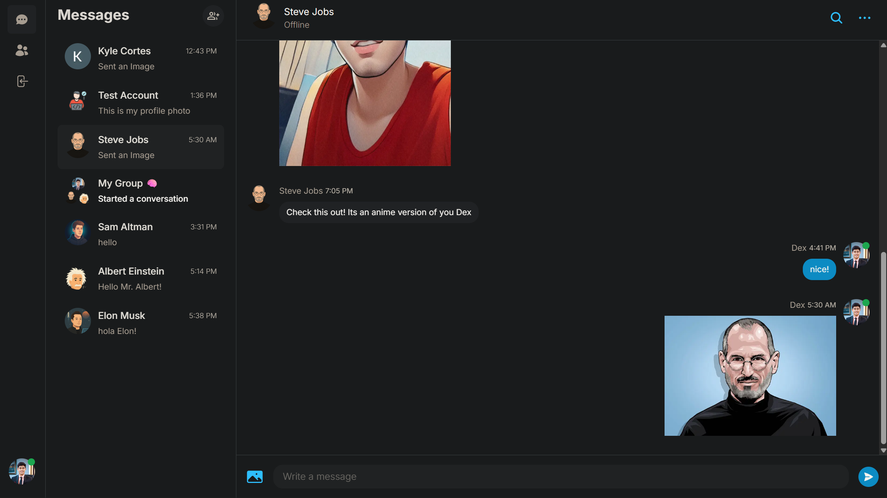

<div align="center">
  <br />
    <a href="https://dex-messenger.vercel.app/" target="_blank">
      <kbd></kbd>
    </a>
  <br />

---

# Dex-Real-Time-Messenger 📨

A full-featured, real-time chat platform built with **Next.js 14 (App Router)** and **TypeScript**.

</div>

---

## 📑 Table of Contents

- ✨ [Project Highlights](#project-highlights)
- 📌 [Project Overview](#project-overview)
- 🛠️ [Tech Stack](#tech-stack)
- 📦 [package.json at a Glance](#packagejson-at-a-glance)
- 🚀 [Getting Started](#getting-started)
- 🧩 [Feature Breakdown](#feature-breakdown)
- 📚 [Documentation](#documentation)
- 🗂️ [Project Structure](#project-structure)
- 🛠️ [Available Commands](#available-commands)
- 🚢 [Deployment](#deployment)
- 📜 [License](#license)
- 👨‍💻 [About Me](#about-me)
- 🙏 [Acknowledgments](#acknowledgments)
- 📌 [Note](#note)

---

## <a name="project-highlights">✨ Project Highlights</a>

- **`Built from Scratch`**: 100% coded from the ground up to learn the full-stack messaging architecture with guidance from "codewithantonio."

- **`Modern PERN Stack`**: Next.js 14 (App Router), React 18, MongoDB, Prisma ORM for enterprise-level type safety and server-side rendering.

- **`Styling`**: Tailwind CSS + Headless UI for responsive and accessible UIs optimized for all screen sizes.

- **`Global State`**: Zustand for lightning-fast client state management with minimal boilerplate.

- **`Security`**: NextAuth.js, bcrypt, CORS, and JWT session-based authentication with OAuth providers (Google, GitHub).

- **`Real-Time Messaging`**: Pusher channels enable instant message delivery, presence tracking, and live conversation updates.

- **`DB Integration`**: MongoDB managed via Prisma ORM with comprehensive schema documentation and type-safe operations.

- **`DX`**: Structured error handling on both frontend and backend for real-world readiness and great dev experience.

- **`Front-to-Back Ownership`**: Every line written was part of my step-by-step growth in full-stack architecture.

- **`Beyond Tutorial Learning`**: Started with codewithantonio's guidance but evolved through my own implementation, experimentation, and customization.

- **`📚 Production-Ready Documentation`**: Comprehensive JSDoc comments throughout the entire codebase with mentoring tone, explaining the "why" behind every code decision.

- **`🎓 Educational Codebase`**: Context-aware documentation serves as learning resource for understanding modern full-stack development patterns.

- **`Beginner Friendly`**: Clean code, clear structure, plenty of learning opportunities in authentication, real-time features, and database design.

- **`Deployment Ready`**: Multiple deployment options with detailed guides for Vercel hosting and environment setup.

---

## <a name="project-overview">📌 Project Overview</a>

This is **my** implementation of a Facebook-style messenger.  
It delivers instant chat, read receipts, media sharing, and presence indicators all wrapped in a sleek, responsive UI.

**Highlights**

- 💬 Instant messaging with real-time updates (Pusher)
- 👀 Read receipts & online/offline indicators
- 📎 Image / file uploads (Cloudinary)
- 👥 One-on-one **and** group conversations
- 🔍 In-thread message search
- 🔐 Secure auth (credentials + Google / GitHub OAuth)
- 🖥️ Mobile-first responsive design
- 📖 **Comprehensive JSDoc documentation** with mentoring tone

> **Inspiration:** Antonio Erdeljac’s Messenger Clone tutorial jump-started this build, but files have been reviewed, refactored, and expanded to match **my** standards.

---

## <a name="tech-stack">🛠️ Tech Stack</a>

| Layer / Purpose        | Technology                             |
| ---------------------- | -------------------------------------- |
| **Framework**          | Next.js 14 (App Router) + React        |
| **Language**           | TypeScript                             |
| **Styling**            | Tailwind CSS                           |
| **Realtime**           | Pusher & Pusher-JS                     |
| **Database**           | MongoDB + Prisma ORM                   |
| **Auth**               | NextAuth (Credentials, Google, GitHub) |
| **Storage / CDN**      | Cloudinary                             |
| **Forms / Validation** | React-Hook-Form                        |
| **State**              | Zustand (minimal global state)         |
| **Notifications**      | react-hot-toast                        |
| **Build / Deploy**     | Vercel                                 |

---

## <a name="packagejson-at-a-glance">📦 `package.json` at a Glance</a>

### Major Runtime Dependencies

| Package                 | Version                 |
| ----------------------- | ----------------------- |
| next                    | `^14.2.28`              |
| react / react-dom       | `^18`                   |
| typescript              | `^5`                    |
| prisma & @prisma/client | `^6.6.0`                |
| next-auth               | `^4.24.5`               |
| pusher / pusher-js      | `^5.2.0` / `^8.4.0-rc2` |
| axios                   | `^1.6.5`                |
| tailwindcss             | `^3.3.0`                |
| bcrypt                  | `^5.1.1`                |
| react-hook-form         | `^7.49.3`               |
| zustand                 | `^4.5.0`                |
| react-hot-toast         | `^2.4.1`                |

<details>
<summary>View full <code>package.json</code></summary>

```json
{
  "name": "dex-real-time-messenger",
  "version": "0.1.0",
  "private": true,
  "scripts": {
    "dev": "next dev",
    "build": "next build",
    "start": "next start",
    "lint": "next lint",
    "postinstall": "prisma generate"
  },
  "dependencies": {
    "@headlessui/react": "^1.7.18",
    "@next-auth/prisma-adapter": "^1.0.7",
    "@prisma/client": "^6.6.0",
    "@tailwindcss/forms": "^0.5.7",
    "axios": "^1.6.5",
    "bcrypt": "^5.1.1",
    "clsx": "^2.1.0",
    "date-fns": "^3.3.1",
    "lodash": "^4.17.21",
    "next": "^14.2.28",
    "next-auth": "^4.24.5",
    "next-cloudinary": "^5.20.0",
    "next-superjson-plugin": "^0.6.3",
    "pusher": "^5.2.0",
    "pusher-js": "^8.4.0-rc2",
    "react": "^18",
    "react-dom": "^18",
    "react-hook-form": "^7.49.3",
    "react-hot-toast": "^2.4.1",
    "react-icons": "^5.0.1",
    "react-select": "^5.8.0",
    "react-spinners": "^0.13.8",
    "zustand": "^4.5.0"
  },
  "devDependencies": {
    "@types/bcrypt": "^5.0.2",
    "@types/lodash": "^4.14.202",
    "@types/node": "^20",
    "@types/react": "^18",
    "@types/react-dom": "^18",
    "autoprefixer": "^10.0.1",
    "eslint": "^8",
    "eslint-config-next": "14.0.4",
    "postcss": "^8",
    "prisma": "^6.6.0",
    "tailwindcss": "^3.3.0",
    "typescript": "^5"
  }
}
```

</details>

---

## <a name="getting-started">🚀 Getting Started</a>

### ✅ Prerequisites

- Node 16 +
- MongoDB (local or Atlas)
- `npm` or `pnpm`

### 🧪 Environment Variables

Create a **`.env`** file in the project root:

```env
#Mongodb Atlas db
DATABASE_URL="mongodb+srv://<username>:<password>@cluster0.z9tbmpr.mongodb.net/test"
NEXTAUTH_SECRET="NEXTAUTH_SECRET"

#Vercel URL
NEXTAUTH_URL=https://appName.vercel.app

#Local Development URL
NEXTAUTH_URL=http://localhost:3000

#Cloudinary for file upload storage
NEXT_PUBLIC_CLOUDINARY_CLOUD_NAME=
#From Cloudinary Preset
NEXT_PUBLIC_CLOUDINARY_UPLOAD_PRESET=

#Github Authentication
GITHUB_ID=
GITHUB_SECRET=

#Google Authentication
GOOGLE_CLIENT_ID=
GOOGLE_CLIENT_SECRET=

#Pusher for real-time messaging functionality
NEXT_PUBLIC_PUSHER_APP_KEY=
PUSHER_APP_ID=
PUSHER_SECRET=
PUSHER_CLUSTER="mt1"
```

### 📦 Installation

```bash
# 1 – Clone
git clone https://github.com/dexC166/dex-real-time-messenger.git
cd dex-real-time-messenger

# 2 – Install deps
npm install            # or pnpm install

# 3 – Sync Prisma schema
npx prisma db push

# 4 – Run dev server
npm run dev
# Visit http://localhost:3000
```

---

## <a name="feature-breakdown">🧩 Feature Breakdown</a>

### Authentication

- Credentials sign-up / login
- Google & GitHub OAuth
- Secure JWT sessions (NextAuth)

### Chat Core

- Realtime Pusher channels
- Read receipts & presence indicators
- Media attachments (Cloudinary)
- Group chat CRUD & avatars
- Client-side message search

### UI / UX

- Tailwind-powered mobile-first layouts
- Animated sidebar & modals
- Profile drawer with member list

### My Enhancements

- Migrated to **Next.js 14 App Router**
- Refactored API routes for clean contracts
- Hardened message rendering for edge-case files
- Improved group profile drawer layout & info density
- **Added comprehensive JSDoc documentation** with mentoring tone throughout the codebase
- **Enhanced security documentation** with detailed explanations of authentication and authorization patterns
- **Context-aware code comments** that explain integration patterns and usage examples

---

## <a name="documentation">📚 Documentation</a>

- 🏗️ [Architecture Overview](./architecture.md)
- 🗺️ [User Flow Diagram](./flowchart.md)
- 📖 [Code Documentation](#code-documentation)

### 📖 Code Documentation

This codebase features **comprehensive JSDoc documentation** throughout all major components, API routes, and utilities. The documentation follows a **mentoring tone** approach, explaining not just _what_ the code does, but _why_ design decisions were made.

#### 🎯 Documentation Philosophy

- **Mentoring Approach**: Comments are written as if teaching a junior developer
- **Context-Aware**: Documentation includes usage patterns and integration examples
- **Security-Focused**: Emphasizes security considerations and best practices
- **Architecture-Driven**: Explains how components fit into the overall system

#### 📋 Documented Areas

| Component Type       | Files Documented          | Key Features                                      |
| -------------------- | ------------------------- | ------------------------------------------------- |
| **API Routes**       | All `/api/*` endpoints    | Authentication, validation, error handling        |
| **React Components** | All major UI components   | Props, state management, integration patterns     |
| **Custom Hooks**     | All `/hooks/*` files      | State management, real-time features, performance |
| **Server Actions**   | All `/actions/*` files    | Data fetching, security, database operations      |
| **Configuration**    | Core config files         | Setup, environment, integration patterns          |
| **Utilities**        | Library and utility files | Authentication, real-time, database connections   |

#### 🔍 Documentation Highlights

- **Security Patterns**: Detailed explanations of authentication, authorization, and data validation
- **Real-time Features**: Comprehensive coverage of Pusher integration and presence tracking
- **Database Operations**: Prisma ORM patterns, query optimization, and error handling
- **State Management**: Zustand store patterns and React state synchronization
- **API Integration**: Request/response patterns, error handling, and client integration
- **Performance Considerations**: Optimization strategies and memory management

#### 💡 Example Documentation Style

```typescript
/**
 * User-Authorized Conversation Access Validation
 *
 * Validates that the current user has access to the specified conversation
 * before retrieving messages. This validation prevents unauthorized access
 * to conversation messages and ensures proper data security.
 *
 * Why conversation access validation is essential:
 * - Security: Prevents unauthorized access to conversation messages
 * - Privacy: Protects user data from unauthorized access
 * - Data integrity: Ensures proper user-specific data access
 * - User experience: Provides clear error messages for unauthorized access
 * - Compliance: Maintains proper data access controls
 */
```

#### 🚀 Benefits for Developers

- **Onboarding**: New developers can understand the codebase quickly
- **Maintenance**: Clear explanations make debugging and updates easier
- **Security**: Security considerations are explicitly documented
- **Best Practices**: Patterns and approaches are explained with reasoning
- **Integration**: Usage examples show how components work together

---

## <a name="project-structure">🗂️ Project Structure</a>

```
app/                  # Next.js App Router structure
  └── (site)/         # Main route group
  └── actions/        # Server actions and form logic
  └── api/            # API route handlers
  └── components/     # Reusable React components
  └── context/        # React context providers
  └── conversations/  # Conversation-related routes and logic
  └── hooks/          # Custom React hooks
  └── libs/           # External libraries & utilities
  └── types/          # TypeScript types shared across app
  └── users/          # User-related routes and logic
  └── favicon.ico     # Favicon Icon Logo
  └── globals.css     # Global CSS
  └── layout.tsx      # Root layout component for app router

pages/                # For Pusher
prisma/               # Prisma schema and DB client setup
public/               # Static files

.env                  # Environment variables
.env.example          # Example env for collaborators

architecture.md       # Overview of the system design and tech stack
flowchart.md          # Visual flow diagram of feature/component interaction

next.config.js        # Next.js configuration
next-env.d.ts         # TypeScript support for Next.js
tailwind.config.ts    # Tailwind CSS configuration
postcss.config.js     # PostCSS configuration
tsconfig.json         # TypeScript compiler settings
tsconfig.tsbuildinfo  # TypeScript build cache

package.json          # Project dependencies and scripts
package-lock.json     # Exact version lockfile for reproducible installs
README.md             # Project documentation (you’re here)

```

---

## <a name="available-commands">🛠️ Available Commands</a>

| Command       | Purpose                         |
| ------------- | ------------------------------- |
| `dev`         | Launch local development server |
| `build`       | Create a production build       |
| `start`       | Run the production build        |
| `lint`        | ESLint code-quality checks      |
| `postinstall` | Generates Prisma                |

---

## <a name="deployment">🚢 Deployment</a>

1. Push the repo to GitHub.
2. Import it into **Vercel**.
3. Add the environment variables above.
4. Click **Deploy**, done!

_(Any platform that supports Next.js 14 works; Vercel just makes it painless.)_

---

## <a name="license">📜 License</a>

© 2025 **Dayle Cortes** – All rights reserved.  
Please contact me for licensing or commercial inquiries.

---

## <a name="about-me">👨‍💻 About Me</a>

I’m **Dayle Cortes**, a full-stack developer focused on responsive web experiences.  
This messenger app showcases my ability to integrate modern frameworks, realtime infrastructure, and elegant UI design into a production-ready app.

---

## <a name="acknowledgments">🙏 Acknowledgments</a>

- **Antonio Erdeljac** aka "_codewithantonio_", his tutorial kick-started this build.
- The open-source communities behind **Next.js**, **Prisma**, **Tailwind CSS**, and **Pusher**.

---

## <a name="note">📌 Note</a>

This app was originally built by following @codewithantonio’s YouTube tutorial for learning and inspiration.  
The project was developed entirely in my local IDE (outside of GitHub) without initializing git, and I’ve reconstructed the commit history solely to reflect a realistic development flow and demonstrate my understanding of fullstack architecture and recent modifications, not as a record of the actual chronological build.

---

## 📨

_Happy chatting!_ 🚀
