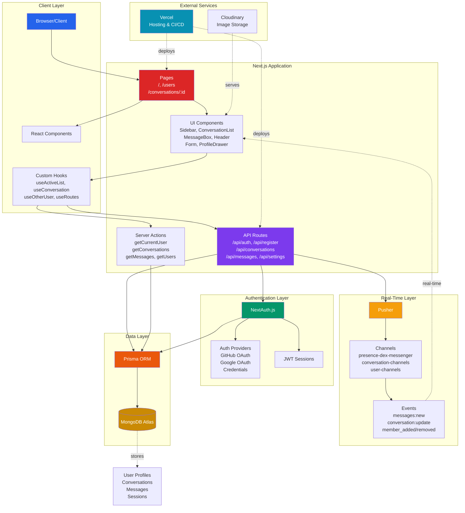

# 📲 Real-Time-Messenger Architecture

## Modern, Scalable, and Developer Friendly

Dex-Real-Time-Messenger is built from the ground up to be robust, maintainable, and a pleasure to work on. The system leverages production-level design patterns and modern tools, drawing clear inspiration from industry leaders but with architecture and features thoughtfully tailored by me to match and learn today's best practices.

---

## 📑 Table of Contents

- 🔑 [Key Principles](#key-principles)
- 🌿 [System Overview](#system-overview)
- 📦 [Tech Stack](#tech-stack)
- 🏗️ [Architecture Layers](#architecture-layers)
- 🚀 [Deployment, Security, and Maintainability](#deployment-security-maintainability)
- 🤔 [Why This Architecture?](#why-this-architecture)

---

### 🔑 Key Principles

| Principles                         | Purpose                                                                                                                                                                                                         |
| ---------------------------------- | --------------------------------------------------------------------------------------------------------------------------------------------------------------------------------------------------------------- |
| **Separation of Concerns**         | Each layer (UI, data, domain, styling) is cleanly separated for clarity and maintainability                                                                                                                     |
| **Type Safety Everywhere**         | TypeScript is used across the codebase to catch bugs early and ensure confidence in refactoring                                                                                                                 |
| **API-First**                      | Next.js API routes provide all backend logic: authentication, conversation management, real-time messaging, and user management, while the frontend consumes these endpoints as if from a microservices backend |
| **Optimized Developer Experience** | Rapid feedback via hot-reloading, auto-formatting, and Prisma migrations/scripts makes extending or debugging the project friendly and efficient                                                                |

---

### 🌿 System Overview

**Additional Infrastructure:**

- **Vercel (CI/CD)**: Wraps, builds, and hosts the Next.js application with serverless functions
- **Environment Variables**: Secrets injected securely at build and runtime
- **Static Assets**: Served via CDN for optimal performance
- **Cloudinary**: Image uploads and optimization for user avatars and message attachments

---

## 📦 Tech Stack

| Layer            | Technology              | Purpose                                 |
| ---------------- | ----------------------- | --------------------------------------- |
| **Frontend**     | React 18, TypeScript    | UI components and type safety           |
| **Styling**      | Tailwind CSS            | Utility-first styling                   |
| **UI Framework** | Next.js 14 (App Router) | Routing, server components, API routes  |
| **State**        | Zustand                 | Lightweight state management            |
| **Real-time**    | Pusher                  | WebSocket-based real-time communication |
| **Database**     | MongoDB                 | NoSQL document database                 |
| **ORM**          | Prisma                  | Type-safe database client               |
| **Auth**         | NextAuth.js             | Authentication and session management   |
| **Forms**        | React Hook Form         | Form state management and validation    |
| **File Storage** | Cloudinary              | CDN for image and file storage          |

---

## 🏗️ Architecture Layers

### 1. Frontend Architecture

The frontend follows a component-based architecture with React and TypeScript:

- **Components**: Reusable UI elements (`app/components/`)
- **Layout**: App-wide layout components (`app/layout.tsx`)
- **Pages**: Route-specific page components
- **Contexts**: Global state providers (`app/context/`)
- **Hooks**: Custom React hooks for shared logic (`app/hooks/`)

#### Key UI Components

- **Sidebar**: Navigation and conversation list
- **ConversationList**: Displays all user conversations
- **MessageBox**: Individual message component
- **Form**: Message input and sending interface
- **ProfileDrawer**: User and group information panel
- **Modal**: Reusable modal component for various dialogs

### 2. State Management

The application uses a hybrid state management approach:

- **Zustand**: For global app state (active users list via `useActiveList` store)
- **React Context**: For auth state (`AuthContext`) and UI toast notifications (`ToasterContext`)
- **Server Actions**: For data fetching and server-side operations (`getCurrentUser`, `getConversations`, `getMessages`, `getUsers`)
- **Local Component State**: For UI-specific states (forms, modals, local interactions)
- **React Hook Form**: For form state management and validation

### 3. Authentication Flow

Authentication is handled through NextAuth.js with multiple strategies:

1. **Credential Authentication**: Email/password login flow
2. **OAuth Providers**:
   - Google OAuth integration
   - GitHub OAuth integration
3. **Session Management**: JWT-based with secure HTTP-only cookies

The auth flow is implemented in `app/api/auth/[...nextauth]/route.ts` and configured in `app/libs/authOptions.ts`.

### 4. Data Model

The data model is defined in Prisma schema (`prisma/schema.prisma`):

#### Core Entities

- **User**: User account information and relationships
- **Account**: OAuth account connections
- **Conversation**: Chat room containing messages
- **Message**: Individual chat messages with metadata
- **Seen**: Tracking which users have seen which messages

#### Key Relationships

- User to Conversation: Many-to-many (users can be in multiple conversations)
- User to Message: One-to-many (user can send many messages)
- Conversation to Message: One-to-many (conversation contains many messages)
- User to Seen: One-to-many (user can see many messages)

### 5. API Layer

The API is structured using Next.js 14 App Router API routes:

- `/api/auth/[...nextauth]/route.ts`: Authentication endpoints
- `/api/register/route.ts`: User registration
- `/api/conversations/route.ts`: Conversation CRUD operations
- `/api/messages/route.ts`: Message operations
- `/api/settings/route.ts`: User profile and settings

### 6. Real-time Architecture

The real-time capabilities are powered by Pusher:

1. **Server-side Push**: Messages are pushed to Pusher channels when created
2. **Client Subscription**: Clients subscribe to relevant channels
3. **Events**: Real-time events include:
   - `messages:new`: New message notifications
   - `conversation:new`: New conversation created
   - `conversation:update`: Conversation details updated
   - `user:update`: User presence status changes

Implementation details:

- `app/libs/pusher.ts`: Pusher configuration
- `pages/api/pusher/auth.ts`: Pusher authentication endpoint
- `app/hooks/useActiveChannel.ts`: Hook for managing Pusher channel subscriptions

### 7. Server-Side Functions

The application leverages Next.js server components and actions:

- `app/actions/`: Server-side data fetching functions
  - `getCurrentUser.ts`: Retrieves authenticated user data
  - `getConversations.ts`: Fetches user conversations
  - `getMessages.ts`: Retrieves conversation messages

### 8. Deployment Architecture

The application is designed to be deployed on Vercel with:

- Serverless functions for API routes
- Edge caching for static assets
- Environment variables for configuration
- MongoDB Atlas for database hosting
- Pusher cloud service for WebSocket communication
- Cloudinary for file storage

---

- **Frontend**: Built with React 18 (via Next.js) and powered by TypeScript, for a highly interactive, performant user experience. The UI follows modern messaging conventions with custom component abstractions and layout optimizations.
- **Styling**: Tailwind CSS enables rapid prototyping and pixel-perfect designs that work across devices, following design tokens and utility-first standards.
- **Server/Backend**: All server logic sits within Next.js API routes, which are stateless and organized by domain (e.g., `/api/conversations`, `/api/messages`). Business logic leverages Prisma for safe and expressive database access.
- **Authentication & Identity**: NextAuth.js is configured for multi-provider auth (GitHub, Google, email/password) and hardened with JWTs and secrets. Sessions are transparent and secure, with custom logic layered in where needed.
- **Database / ORM**: MongoDB (via Prisma) is used for flexible, scalable data storage, chosen for its compatibility with messaging workflows (denormalized conversation data, fast reads/writes, array operations for participants and read receipts).
- **State Management**: The app uses Zustand for minimal, global UI state (active users list), React Context for auth and notifications, and Server Actions for efficient server-state operations.
- **Forms**: All forms use React Hook Form with controlled inputs, providing robust form state management, validation, and submission handling.
- **Real-Time**: Pusher provides WebSocket-based real-time communication for instant message delivery, conversation updates, and user presence tracking.

---

### 🚀 Deployment, Security, and Maintainability

- **CI/CD**: Deployed through Vercel, enabling serverless scalability, atomic deployments, rollbacks, and preview environments.
- **Code Quality**: Enforced by ESLint, strict TypeScript configuration, and cleanly-typed global definitions.
- **Secrets & Config**: All sensitive credentials are kept in environment variables, following 12-factor app methodology.
- **Performance**: All critical paths are optimized: minimal client bundle, statically typed code, type-safe database queries, efficient Pusher subscriptions, and lazy loading of expensive assets.
- **Security Features**:
  - JWT-based authentication with HTTP-only cookies
  - Route protection via Next.js middleware
  - Pusher channel authorization for private conversations
  - Server-side validation of all inputs
  - Secure password hashing with bcrypt
  - Protected API routes with session validation

---

## 🤔 Why This Architecture?

This is not just a clone, nor is it a loose assembly of tutorials. Every layer is the result of evaluating tradeoffs and focusing on developer happiness, security, scalability, and a premium messaging user experience.

I understand the architecture end-to-end, and chose each tool or technique specifically for:

- Real-time communication (Pusher for WebSocket-based messaging, presence tracking)
- Security and privacy (NextAuth with JWT, bcrypt password hashing, channel authorization)
- Speed to market and flexibility (Next.js 14 App Router, Tailwind, Prisma on MongoDB)
- Long-term maintainability (strong typing, modular file structure, API abstraction, server actions)
- Developer experience (TypeScript everywhere, Prisma type safety, hot reloading)

---

For micro-level user-flow, please refer to [flowchart.md](./flowchart.md).

---

© 2025 Dayle Cortes - All Rights Reserved
