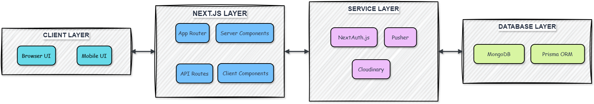

# 📲💻 Real-Time-Messenger Architecture

This document outlines the architecture of my Real-Time Messenger application built with Next.js 14, focusing on the design decisions, data flow, and technical implementation.

---

## 📑 Table of Contents

- 🌿 [System Overview](#-system-overview)
- 📦 [Tech Stack](#-tech-stack)
- 🏗️ [Architecture Layers](#architecture-layers)
- 🔐 [Security Considerations](#-security-considerations)
- 📈 [Performance Optimizations](#-performance-optimizations)
- 🛠️ [Future Improvements](#future-improvements)

---

## 🌿 System Overview

The Real-Time Messenger is built as a modern full-stack application with real-time capabilities, following a client-server architecture within Next.js 14's App Router framework.

## 

---

## 📦 Tech Stack

| Layer            | Technology              | Purpose                                 |
| ---------------- | ----------------------- | --------------------------------------- |
| **Frontend**     | React 18, TypeScript    | UI components and type safety           |
| **Styling**      | Tailwind CSS            | Utility-first styling                   |
| **UI Framework** | Next.js 14 (App Router) | Routing, server components, API routes  |
| **State**        | Zustand                 | Lightweight state management            |
| **Real-time**    | Pusher                  | WebSocket-based real-time communication |
| **Database**     | MongoDB                 | NoSQL document database                 |
| **ORM**          | Prisma                  | Type-safe database client               |
| **Auth**         | NextAuth.js             | Authentication and session management   |
| **Forms**        | React Hook Form         | Form state management and validation    |
| **File Storage** | Cloudinary              | CDN for image and file storage          |

---

## 🏗️ Architecture Layers

### 1. Frontend Architecture

The frontend follows a component-based architecture with React and TypeScript:

- **Components**: Reusable UI elements (`app/components/`)
- **Layout**: App-wide layout components (`app/layout.tsx`)
- **Pages**: Route-specific page components
- **Contexts**: Global state providers (`app/context/`)
- **Hooks**: Custom React hooks for shared logic (`app/hooks/`)

#### Key UI Components

- **Sidebar**: Navigation and conversation list
- **ConversationList**: Displays all user conversations
- **MessageBox**: Individual message component
- **Form**: Message input and sending interface
- **ProfileDrawer**: User and group information panel
- **Modal**: Reusable modal component for various dialogs

### 2. State Management

The application uses a hybrid state management approach:

- **Zustand**: For global app state (active users, conversations)
- **React Context**: For auth state and UI toast notifications
- **React Query**: For data fetching, caching, and synchronization
- **Local Component State**: For UI-specific states

### 3. Authentication Flow

Authentication is handled through NextAuth.js with multiple strategies:

1. **Credential Authentication**: Email/password login flow
2. **OAuth Providers**:
   - Google OAuth integration
   - GitHub OAuth integration
3. **Session Management**: JWT-based with secure HTTP-only cookies

The auth flow is implemented in `app/api/auth/[...nextauth]/route.ts` and configured in `app/libs/authOptions.ts`.

### 4. Data Model

The data model is defined in Prisma schema (`prisma/schema.prisma`):

#### Core Entities

- **User**: User account information and relationships
- **Account**: OAuth account connections
- **Conversation**: Chat room containing messages
- **Message**: Individual chat messages with metadata
- **Seen**: Tracking which users have seen which messages

#### Key Relationships

- User to Conversation: Many-to-many (users can be in multiple conversations)
- User to Message: One-to-many (user can send many messages)
- Conversation to Message: One-to-many (conversation contains many messages)
- User to Seen: One-to-many (user can see many messages)

### 5. API Layer

The API is structured using Next.js 14 App Router API routes:

- `/api/auth/[...nextauth]/route.ts`: Authentication endpoints
- `/api/register/route.ts`: User registration
- `/api/conversations/route.ts`: Conversation CRUD operations
- `/api/messages/route.ts`: Message operations
- `/api/settings/route.ts`: User profile and settings

### 6. Real-time Architecture

The real-time capabilities are powered by Pusher:

1. **Server-side Push**: Messages are pushed to Pusher channels when created
2. **Client Subscription**: Clients subscribe to relevant channels
3. **Events**: Real-time events include:
   - `messages:new`: New message notifications
   - `conversation:new`: New conversation created
   - `conversation:update`: Conversation details updated
   - `user:update`: User presence status changes

Implementation details:

- `app/libs/pusher.ts`: Pusher configuration
- `pages/api/pusher/auth.ts`: Pusher authentication endpoint
- `app/hooks/useActiveChannel.ts`: Hook for managing Pusher channel subscriptions

### 7. Server-Side Functions

The application leverages Next.js server components and actions:

- `app/actions/`: Server-side data fetching functions
  - `getCurrentUser.ts`: Retrieves authenticated user data
  - `getConversations.ts`: Fetches user conversations
  - `getMessages.ts`: Retrieves conversation messages

### 8. Deployment Architecture

The application is designed to be deployed on Vercel with:

- Serverless functions for API routes
- Edge caching for static assets
- Environment variables for configuration
- MongoDB Atlas for database hosting
- Pusher cloud service for WebSocket communication
- Cloudinary for file storage

---

## 🔐 Security Considerations

1. **Authentication**: Secure JWT handling with HTTP-only cookies
2. **Authorization**: Route guards for protected content
3. **Data Validation**: Server-side validation of all inputs
4. **Secure Credentials**: Environment variables for secrets
5. **CSRF Protection**: Built-in Next.js CSRF protection

---

## 📈 Performance Optimizations

1. **Code Splitting**: Automatic code splitting by Next.js
2. **Image Optimization**: Next.js Image component and Cloudinary
3. **Incremental Static Regeneration**: For static parts of the application
4. **Optimistic UI Updates**: Update UI before server confirmation
5. **Selective Presence Updates**: Only necessary real-time updates are transmitted

---

## 🛠️ Future Architecture Considerations

1. **End-to-End Encryption**: Implementing message encryption
2. **Offline Support**: Service workers for offline capability
3. **Voice/Video Calling**: WebRTC integration
4. **Notification Service**: Push notifications for mobile devices
5. **Analytics Pipeline**: User behavior analytics

---

© 2025 Dayle Cortes - All Rights Reserved
