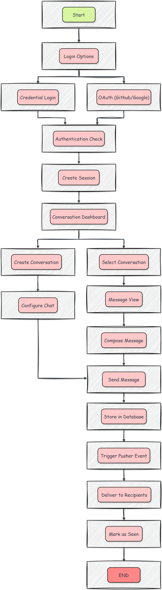

# 🔄 Dex Messenger User Flow

This document outlines the detailed user journey and message lifecycle in the **Dex Messenger** application. It walks through every step from login to real-time-message delivery, highlighting the behind-the-scenes mechanics and architecture integrations.

---

## 📑 Table of Contents

- 📱 [Authentication & Messaging Flow](#authentication-messaging-flow)
- 🔐 [Authentication Flow Breakdown](#authentication-flow-breakdown)
- 💬 [Messaging Flow Breakdown](#messaging-flow-breakdown)
- 🧪 [Technical Implementation Highlights](#technical-implementation-highlights)
- 🚀 [Performance Optimizations](#performance-optimizations)

---

## 📱 Authentication & Messaging Flow

The diagram below visualizes the high-level application flow — starting from user entry and ending with message delivery and read receipts.

## 

---

## 🔐 Authentication Flow Breakdown

### 1. Application Access

- The user opens the app via browser or mobile.
- This triggers the initial load of the Next.js app.

### 2. Login Screen Displayed

- The user is presented with two login methods:
  - **Email/Password (Credentials)**
  - **OAuth** (Google or GitHub)

### 3. Login Method Selected

- For **credentials**: User inputs email + password.
- For **OAuth**: User is redirected to the provider's login page.

### 4. Verification

- **Credentials**: Password is compared against hashed record in the DB.
- **OAuth**: External provider validates the token and returns user info.

### 5. Session Initialization

- On success:
  - A secure **JWT** is generated.
  - Session is established via **NextAuth.js**.
  - **HTTP-only cookies** are set for session persistence.

---

## 💬 Messaging Flow Breakdown

### 6. Dashboard View

- After login, the user sees:
  - Conversation list
  - Active user indicators
  - Navigation options (profile, new chat)

### 7. Conversation Actions

User can:

- **Start a new conversation** (individual or group)
- **Select existing conversation** to continue chatting

### 8. New Conversation Setup

If creating a new conversation:

- Recipients are selected
- Optional: group chat name and avatar are configured

### 9. Chat Interface Displayed

- Previous messages are fetched from MongoDB
- Read receipts and online status are shown

### 10. Composing a Message

- User enters text and/or attaches media via **Cloudinary**
- Messages are composed using a rich input box

### 11. Sending the Message

- Message undergoes client-side validation
- **Optimistic UI** updates: message shows instantly in the UI
- Request is sent to the backend via API

### 12. Backend Message Handling

- Message is validated and stored in MongoDB via **Prisma**
- It’s associated with the sender and conversation thread

### 13. Real-Time Push Trigger

- Once stored:
  - A **Pusher event** is broadcast to the conversation channel
  - Payload includes message data

### 14. Message Delivery to Participants

- **If online**: They receive the message in real time via active Pusher subscription
- **If offline**: Message appears on next conversation load

### 15. Read Receipt Handling

- Upon viewing:
  - "Seen" status is updated in the DB
  - **Pusher event** broadcasts the update
  - UI reflects the read status for all participants

---

## 🧪 Technical Implementation Highlights

### Authentication

- Powered by **NextAuth.js**: `app/api/auth/[...nextauth]/route.ts`
- Credentials are hashed with **bcrypt**
- OAuth handled via official provider SDKs

### Messaging

- API routes: `app/api/messages/route.ts`
- DB interactions via **Prisma Message** model
- Real-time layer uses **Pusher** events
- Optimistic UI improves user responsiveness

### Read Receipts

- Tracked via `app/api/conversations/[conversationId]/seen/route.ts`
- Uses a many-to-many relation (User ↔ Seen ↔ Message)
- Real-time updates pushed with Pusher

---

## 🚀 Performance Optimizations

| Optimization             | Description                                                                |
| ------------------------ | -------------------------------------------------------------------------- |
| **Pagination**           | Loads messages in chunks to avoid long load times                          |
| **Optimistic UI**        | Instant feedback by showing the message before server confirmation         |
| **Selective Fetching**   | Only loads messages for the currently active conversation                  |
| **Scoped Pusher Events** | Events are sent only to relevant users/conversations for bandwidth savings |

---

For high-level system architecture, please refer to [architecture.md](./architecture.md).

---

© 2025 Dayle Cortes — All Rights Reserved
