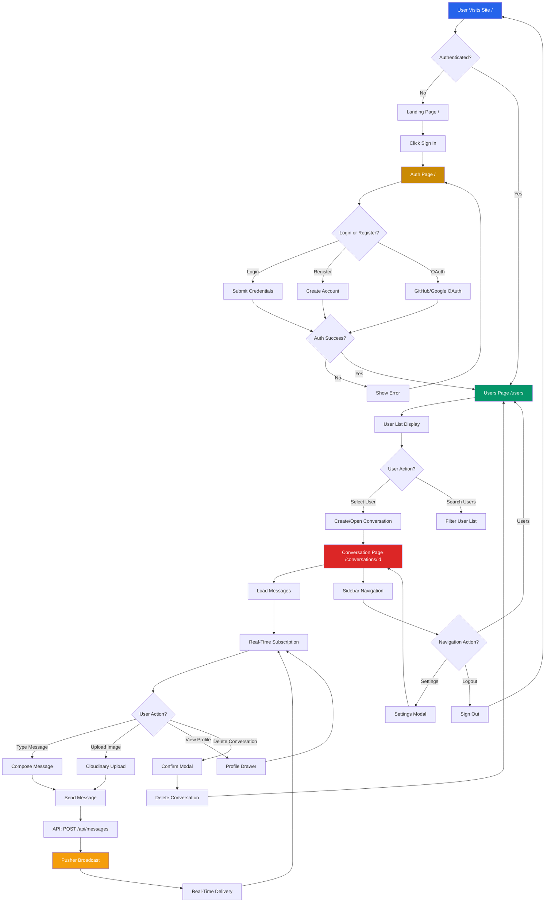

# 🗺️ Feature/User Flowchart

## Micro-level: Seamless User Journey from Sign-in to Messaging

This document visualizes the **step-by-step flow** of a typical user journey in the Dex-Real-Time-Messenger platform.  
It represents how users interact with the product from landing, authentication, user selection, conversation management, and real-time messaging to account settings, mirroring the real experience and helping developers/designers optimize for each interaction.

---

## 📑 Table of Contents

- 🔄 [User Interaction Flow](#user-interaction-flow)
- 🔐 [Authentication Flow Breakdown](#authentication-flow-breakdown)
- 💬 [Messaging Flow Breakdown](#messaging-flow-breakdown)
- 🧪 [Technical Implementation Highlights](#technical-implementation-highlights)
- 🚀 [Performance Optimizations](#performance-optimizations)

---

### 🔄 User Interaction Flow

---

### 📝 Flow Steps (Text Summary)

- **User Visits Site** (`/`)
- -> **Landing Page** (if not authenticated)
  - -> **Sign In / Register** (`/`)
    - If authentication **fails**, show error
    - If successful, continue:
- -> **Users Page** (`/users`)
  - **User List** (All users except current user)
  - **Search/Filter** functionality
    - Clicking user opens **Existing Conversation** or **Creates New**
- -> **Conversation Page** (`/conversations/[id]`)
  - **Message List** (Previous messages with sender info)
  - **Real-Time Subscription** (Pusher channel for live updates)
  - **Message Composition** (Text input with image upload)
    - **Send Message** ➡️ **API Call** ➡️ **Pusher Broadcast** ➡️ **Real-Time Delivery**
  - **Profile Drawer** (View conversation/user details)
  - **Delete Conversation** (Confirmation modal)
  - **Sidebar Navigation**
    - **Settings** (Update profile, avatar)
    - **Back to Users**
    - **Logout**

---

## 🔐 Authentication Flow Breakdown

### 1. Application Access

- The user opens the app via browser or mobile
- Middleware checks authentication status (`middleware.ts`)
- Unauthenticated users are redirected to landing page

### 2. Login Screen Displayed

- Landing page (`/`) displays authentication form
- The user is presented with multiple login methods:
  - **Email/Password (Credentials)** - Traditional login
  - **OAuth** (Google or GitHub) - One-click social authentication

### 3. Login Method Selected

- For **credentials**: User inputs email + password, form validates and submits
- For **OAuth**: User is redirected to the provider's login page (Google/GitHub)
- Registration creates new user with bcrypt-hashed password

### 4. Verification

- **Credentials**: Password is compared against hashed record in the DB using bcrypt
- **OAuth**: External provider validates the token and returns user info
- NextAuth.js handles the authentication flow via `/api/auth/[...nextauth]`

### 5. Session Initialization

- On success:
  - A secure **JWT** is generated by NextAuth.js
  - Session is established and stored in **HTTP-only cookies**
  - User data is stored/updated in MongoDB via Prisma
  - User is redirected to `/users` page

---

## 💬 Messaging Flow Breakdown

### 6. Users Page View

- After login, the user sees `/users` page with:
  - Complete user list (excluding current user)
  - Active user indicators (green dots via Pusher presence)
  - Sidebar navigation (settings, logout)
  - Search/filter functionality

### 7. Conversation Initiation

User can:

- **Select existing user** to open existing conversation or create new one-on-one
- **Create group conversation** (via GroupChatModal)
  - Select multiple users
  - Set group name and avatar
- System checks for existing conversations to avoid duplicates

### 8. Conversation Page Display

When entering a conversation (`/conversations/[id]`):

- **Header**: Displays conversation name, participant info, online status
- **Message List**: Previous messages fetched via `getMessages` server action
- **Real-Time Subscription**: Pusher channel (`conversationId`) is subscribed
- **Message Form**: Text input with image upload button
- **Sidebar**: Navigation remains available

### 9. Real-Time Setup

- Pusher client subscribes to `conversation-[id]` channel
- Listens for `messages:new` events for real-time message delivery
- Presence tracking via `presence-dex-messenger` channel
- Active users list updated via `useActiveList` Zustand store

### 10. Composing a Message

- User enters text in message input or clicks image upload
- **Image Upload**: Opens Cloudinary widget, returns image URL
- **Text Input**: React Hook Form manages form state and validation
- Form prepares message data (body and/or image)

### 11. Sending the Message

- Form submits to `/api/messages` with conversationId, message, and optional image
- **Optimistic UI**: Message appears instantly in sender's UI (not implemented by default)
- Request includes authentication via NextAuth session

### 12. Backend Message Handling

- API route (`/api/messages/route.ts`) validates authentication
- Message is created in MongoDB via Prisma with:
  - `senderId`: Current user
  - `conversationId`: Target conversation
  - `seen`: Initially marked as seen by sender only
  - `body`: Text content (optional)
  - `image`: Cloudinary URL (optional)
- Retry logic handles transaction conflicts (P2034 error)
- Conversation `lastMessageAt` timestamp is updated

### 13. Real-Time Push Trigger

- Once message is stored:
  - **Pusher event** `messages:new` is broadcast to conversation channel
  - Payload includes complete message data with sender info
  - **Pusher event** `conversation:update` is sent to each participant's user channel
  - Updates conversation list for all participants

### 14. Message Delivery to Participants

- **If online**: Message is received instantly via Pusher subscription
  - Body component binds to `messages:new` event
  - Message is added to local state and rendered
  - Scroll to bottom of message list
- **If offline**: Message appears on next page load via server action

### 15. Read Receipt Handling

- When user views conversation:
  - API call to `/api/conversations/[id]/seen` marks messages as seen
  - `seenIds` array updated in MongoDB for messages
  - **Pusher event** `conversation:update` broadcasts read status
  - UI shows read receipts (avatars) for all participants who've seen
  - Last seen timestamp updates in conversation list

---

## 🧪 Technical Implementation Highlights

### Authentication

- Powered by **NextAuth.js**: `app/api/auth/[...nextauth]/route.ts`
- Configuration in `app/libs/authOptions.ts`
- Credentials are hashed with **bcrypt** (12 salt rounds)
- OAuth handled via official provider SDKs (Google, GitHub)
- JWT-based session management with HTTP-only cookies
- Middleware protection: `middleware.ts` guards `/users` and `/conversations` routes
- Pusher channel authorization: `pages/api/pusher/auth.ts`

### User Management

- Server actions for data fetching:
  - `getCurrentUser`: Session validation and user lookup
  - `getUsers`: Fetch all users except current user
  - `getConversations`: Fetch user's conversations with last message
  - `getConversationById`: Fetch specific conversation with participants
  - `getMessages`: Fetch conversation messages with pagination
- User presence tracking via Pusher presence channels
- `useActiveList` Zustand store for global active users state
- `useActiveChannel` hook manages presence channel subscription

### Conversation Management

- API routes:
  - `POST /api/conversations`: Create new conversation (1-on-1 or group)
  - `DELETE /api/conversations/[id]`: Delete conversation
  - `POST /api/conversations/[id]/seen`: Mark messages as seen
- Duplicate conversation prevention for 1-on-1 chats
- Group conversations support multiple participants with custom names
- Conversation list sorted by `lastMessageAt` timestamp

### Messaging

- API route: `POST /api/messages`
- DB interactions via **Prisma Message** model
- Retry logic with exponential backoff for transaction conflicts (P2034)
- Real-time layer uses **Pusher** events:
  - `messages:new`: Broadcast to conversation channel
  - `conversation:update`: Broadcast to each user's personal channel
- Image uploads handled by **Cloudinary** via `next-cloudinary` widget
- Message composition with **React Hook Form**

### Read Receipts

- Tracked via `app/api/conversations/[conversationId]/seen/route.ts`
- Uses a many-to-many relation (User ↔ Seen ↔ Message via `seenIds`)
- Real-time updates pushed with Pusher `conversation:update` events
- Avatar display shows who has seen messages
- Automatic read status when viewing conversation

---

## 🚀 Performance Optimizations

| Optimization                 | Description                                                                                  |
| ---------------------------- | -------------------------------------------------------------------------------------------- |
| **Server Actions**           | Direct database queries from server components, eliminating unnecessary API routes           |
| **Selective Data Fetching**  | Only loads messages for the currently active conversation, not all conversations             |
| **Pusher Channel Scoping**   | Events are sent only to relevant users/conversations for bandwidth savings                   |
| **Presence Channel Caching** | Single presence channel subscription shared across app via `useActiveChannel`                |
| **Message Retry Logic**      | Exponential backoff for transaction conflicts ensures eventual consistency                   |
| **Image Optimization**       | Cloudinary handles image optimization, resizing, and CDN delivery                            |
| **TypeScript Type Safety**   | Prisma generates types, eliminating runtime type errors and enabling compile-time validation |
| **Zustand Minimal State**    | Only active users list in global state; everything else is server-driven or local            |
| **MongoDB Array Operations** | Efficient array operations for conversation participants and message read receipts           |
| **Next.js App Router**       | Server components by default, client components only where needed                            |

---

## 💡 Why This Flowchart?

This flowchart gives the team and newcomers an "at-a-glance" reference of how a user travels through the app. It supports planning for UI/UX, testing, features, and onboarding documentation.

The detailed breakdown ensures developers understand:

- **Authentication flow**: Multi-provider auth with NextAuth.js
- **Real-time mechanics**: Pusher channel subscriptions and event handling
- **Data flow**: Server actions, API routes, and database operations
- **User experience**: From landing to messaging to navigation
- **Technical implementation**: Specific files and patterns used

This documentation is valuable for:

- Onboarding new developers
- Planning feature additions
- Understanding system behavior
- Debugging issues
- Architectural decision-making

---

For high-level system architecture, please refer to [architecture.md](./architecture.md).

---

© 2025 Dayle Cortes — All Rights Reserved
